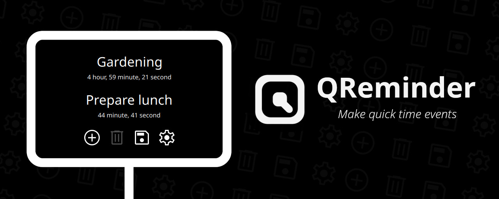

# About

QReminder is an application to create events.

It uses a countdown system instead of date to represent completion, 
which is more suitable for a variety of short tasks.

Want more for your built-in timer? Then this is for you!

# Features

 - Color labeling
 - Save and load with your own method
 - Simple, fast and minimal
 - Cross-platform
 - Kiosk mode
 
# Download

Head over to [releases page](https://github.com/rashlight/QReminder/releases) 
for installers, packages and portable archives.

Here are the list of supported platforms:

|
•
|Windows|MacOS|Linux|Android|iOS|
|--|--|--|--|--|--|
|**Installer**|
✅
|
❌
|
❔1
|
🚫
|
🚫
|
|**Package**|
❔2
|
❌
|
✅3
|
✅
|
❌
|
|**Archive**|
✅
|
❌
|
✅
|
🚫
|
🚫
|

 - ✅: Works out-of-the-box
 - ❔: May work but requires manual configuration
 - ❌: Not working
 - 🚫: Not available for platform

Footnotes:

 - 1 Can be created with Qt Installer Framework (IFW)
 - 2 Can be created with WIX installer
 - 3 Tested on:
     - Ubuntu 24.04 LTS
     - Linux Mint 22 Cinnamon Edition
     - Fedora Workstation 41
     - Rocky Linux Desktop/Workstation 9
     
# FAQ

See [docs/FAQ.md](./docs/FAQ.md).

# Building

See [docs/BUILDING.md](./docs/BUILDING.md).

# Contributions

All contributions are welcome.

# Credits

Made with Qt 6.8. The Qt framework and other related components 
are licensed by GPL, LGPL and various licenses.

Various icons and music files are from Material Design. They are licensed under
Apache License 2.0 and CC-BY 4.0 license, respectively.

# License

Your can use this project under the terms of the GNU General Public License, version 3 
or at your option, any later version. See LICENSE file for more information.
